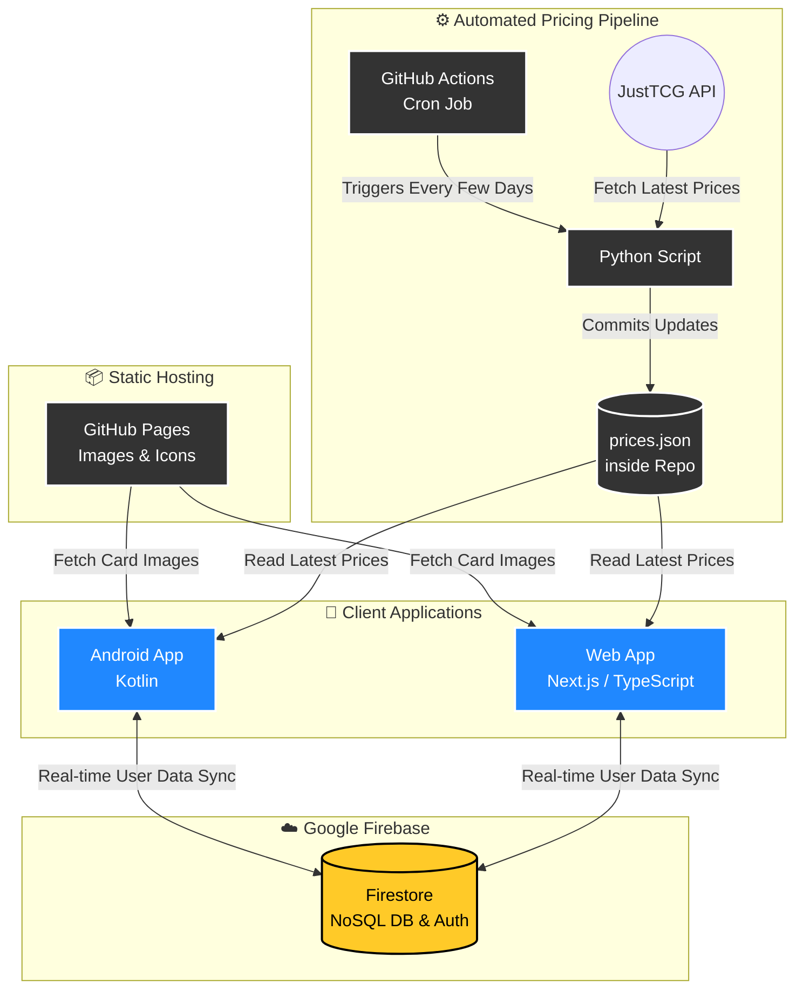

# 🃏 Bounded

**The Ultimate Digital Binder & Interactive Deckbuilder for Riftbound.**

[Live Web App Demo](https://bounded.web.app) • [Download Android App](#) • [Report Bug](https://github.com/LachieBurne/Bounded/issues)

*Placeholder: Replace with a high-quality GIF showing the app and website side-by-side syncing in real-time.*

---

## 📖 Overview

Bounded is a comprehensive cross-platform companion application for the Riftbound TCG. Available as a native Android app and a responsive web application, it provides players with a seamless, real-time ecosystem to manage their collection, track market prices, and craft competitive decks. 

Designed with scalability and cost-efficiency in mind, Bounded leverages a serverless architecture to deliver a premium user experience without overhead.

## ✨ Key Features

### 📁 Smart Digital Binder
* **Visual Grid & Dynamic UI:** Browse all released cards in a sleek grid format. Cards you own are dynamically highlighted using their specific Domain colors (including gradient highlights for multi-domain cards).
* **Live Market Pricing:** Card prices are kept up-to-date via an automated JustTCG API integration. View values in your local currency with real-time conversion rates.
* **Deep Filtering:** Instantly search and filter your collection by Set, Energy Cost, Card Might, Domain Colors, and Card Type.
* **Granular Details:** Click any card to access an expanded view featuring high-resolution artwork, detailed rulings, and pricing trends.

### 📸 OCR Card Scanning (Android Exclusive)
* **Instant Import:** Ditch the manual data entry. Use your phone's camera to live-scan physical cards.
* **Smart Set Detection:** Utilizes on-device language detection libraries to read unique set codes, pinpointing the exact edition, version, and foil status of your scanned card for automatic import into your digital binder.

### ⚔️ Interactive, Guided Deckbuilder
* **Multi-Stage Crafting:** A wizard-like interface guides you through the complex Riftbound deck-building ruleset: *Legend → Champion → 3 Battlefields → 12 Runes → Main Deck → Side Deck*.
* **Advanced Analytics:** Once your deck is built, analyze its viability on the Stats Page:
  * **Financials:** Calculate the total market cost of the deck and the specific cost of the cards you are missing.
  * **Curves:** Visualize your Might and Energy curves via responsive bar graphs.
  * **Composition:** Break down your deck's Domains and Card Types using dynamic donut charts.

*Placeholder: Replace with a GIF showing the guided deck-building process and the interactive stats charts.*

---

## 🏗️ Architecture & Tech Stack

Bounded is built as a distributed, cross-platform system synced perfectly via Google's ecosystem. 

### Frontend
* **Mobile App:** Built natively with **Kotlin** for optimal performance and camera hardware access.
* **Web Companion:** Built with **Next.js** and **TypeScript** for SEO optimization, fast rendering, and type-safe component development.

### Backend & Data
* **Database:** **Google Firestore (NoSQL)**. Selected for its generous free tier and exceptional real-time synchronization capabilities. 
* **Authentication:** **Google Auth** integrated directly with Firestore, allowing users to sign in once and instantly sync their collection data between their phone and browser.
* **Asset Hosting:** Card images, Domain icons, and Rarity icons are served efficiently via **GitHub Pages** to minimize database bandwidth and storage costs.

### Automation & CI/CD
* **Market Price Pipeline:** A custom **Python** script runs on a cron job via **GitHub Actions** every few days. It fetches the latest pricing data from the JustTCG API, processes it, and commits a streamlined JSON file directly back to the repository for the frontend clients to consume.

---

## 🚀 Getting Started

Bounded is designed to be accessible immediately, with no complex setup required for general use.

### 🌐 Web Application
The web companion is fully hosted and ready to use. 
Simply visit: **[bounded.web.app](https://bounded.web.app)**

### 📱 Android Application
You do not need to build the app from source to use it on your device. 

1. Download the latest `.apk` file directly from this repository (located in the `[Insert Folder Name]` folder or the Releases tab).
2. Transfer the `.apk` file to your Android device (or download it directly on your phone).
3. Open the file to install the app. *(Note: You may need to enable "Install unknown apps" in your Android security settings).*
